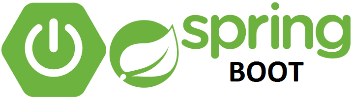

  

<h2 align="center">
   Padrões de Projeto
</h2>

    <b>Projeto realizado durante o bootcamp Santader da DIO onde, foi implementado padrões como, Singleton, Strategy e Facade.</b>

<h2 align="center">
      Ferramentas utilizadas</h2>

    Spring Framework

Java 11

<h2 align="center">
     Projeto</h2>

    A aplicação consiste em um sistema de cadastro de clientes com seus respectivos atributos como endereço. E com a ligação destes clientes com uma conta bancária onde ele pode fazer transações como saque,depósito e transferencia para outro usuário, o sistema é feito com spring, e o banco utilizado e o h2, e os testes das requisiçõs esta sendo feito pelo Swagger. O principal foco deste sistema é mostrar o funcionamento de alguns padrões de projetos como o Singleton, Strategy e o Facade.

 

    

    <i>You can find me or contact me through these networks:</i>
      
    
    
    
    

    
More about me

    
Passionate about technology, always ready to learn and help!
    

    <ul>
        <li>🎓 Information system | Estácio</li>
        <li>🎯 Contributing and creating open source projects</li>
        <li>📚 Studying Javascript | Java | Dev Web | .NET | JavaScript | Angular | SQL</li>
        <li>💬 You can ask me questions, I like to help!</li>
    </ul>

